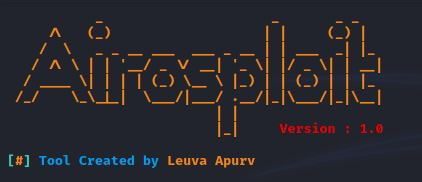

<!-- Airosploit -->

<p align="center">
  
</p>


<p align="center">
  
  
  <!-- 
  
   -->
</p>

<p align="center">
  
  
  
  
</p>

<p align="center">Automated Wifi Hacking Tool</p>

### Features

- Network Discover
- ARP Spoofing
- Packet Sniffing
- DNS Spoofing


### Installation

- Just, Clone this repository
```
$ git clone https://github.com/LeuvaApurv/Airosploit.git
```

- Change to cloned directory and run `setup.sh` then `airosploit.sh`
```
$ cd zphisher
$ sudo bash setup.sh
$ sudo bash airosploit.sh
```
- On first launch, It'll install the dependencies and that's it. `Airosploit` is installed.

### Dependencies

**`Airosploit`** requires following programs to run properly - 
- `Python 3.6`
- `wget`
- `tar`
- `xterm`
- `make`

> All the dependencies will be installed automatically when you run `Airosploit` for the first time.

> Supported Platform : **`Ubuntu/Debian/Kali`**

### Find Me on
<p align="left">
  <a href="https://github.com/LeuvaApurv" target="_blank"></a>
  <a href="https://www.linkedin.com/in/leuvaapurv" target="_blank"></a>
</p>
